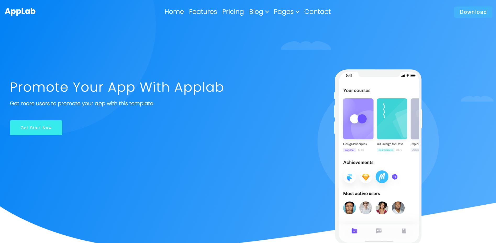

# Responsive website design using HTML & CSS (RWD).

### The challenge

The project was prepared for three breakpoints, using the mobile first convention. Project based on design from [Colorlib.](https://colorlib.com/)

Breakpoints:

- mobile ( to 768px )
- tablet (from 768px to 1200px)
- desktop (from 1200px)

### Link:

- Live: [Check it out](https://idairou.github.io/AppLab-website-rwd/)

## Built with:

- Semantic HTML5 markup
- CSS custom properties
- BEM methodology
- Flexbox
- Mobile-first workflow

## What I learned

This project allowed me to practice more working with BEM methodology, separated `.css` components.
It was also an opportunity to built project starting with mobile view in accordance with the convention Mobile-First. 

## Copyrights

All copyrights belong to [colorlib.com](https://colorlib.com).
The template may be used in accordance with the [licence](https://colorlib.com/wp/licence/).

## Special thanks

Thanks to my [Mentor - devmentor.pl](https://devmentor.pl/) - for providing me with this task and for code review.

### Overview

# Mobile

# Tablet

# Desktop

